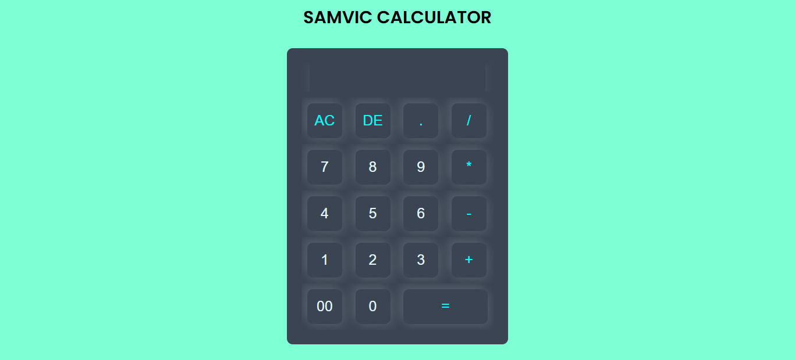

# 🧮 CALCULATOR APP

## 🌟 About the Project  

The Calculator App is a simple and user-friendly web-based calculator that allows users to perform basic arithmetic operations with ease. Designed with a clean and responsive interface, it provides a seamless experience for performing quick calculations.

✨ Features
Addition, subtraction, multiplication, and division operations
Clear button to reset calculations
Responsive design for mobile and desktop users
Error handling for invalid inputs

🚀 Technologies Used

HTML
CSS
JavaScript

🔧 How to Use
Enter numbers using the on-screen buttons or your keyboard.
Select an arithmetic operation (+, -, ×, ÷).
Click the "=" button to display the result.
Use the "C" button to clear the input and start over.

📌 Future Enhancements 
Scientific calculator mode with advanced functions
Dark mode for better user experience
Keyboard shortcuts for faster calculations

## 🚀 Live Demo  
🔗 [Visit the Website](https://mini-quiz-app-eta.vercel.app/)

